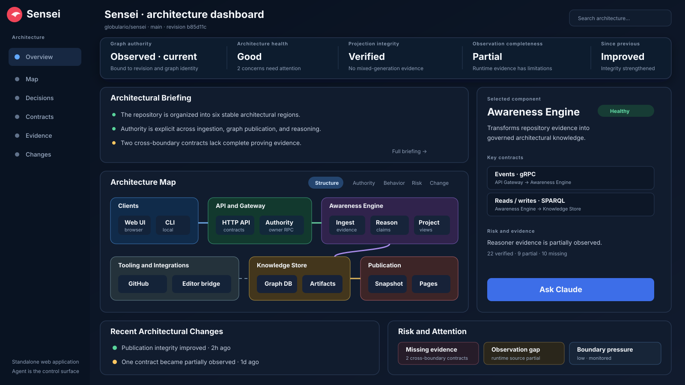

# Sensei Dashboard

A human-scale architectural observatory for [Sensei](https://github.com/globulario/sensei).

Sensei Dashboard presents repository structure, authority, contracts, risk, evidence, and architectural evolution without exposing the raw semantic graph as the primary interface.



## Product boundary

- **Sensei core** constructs and owns architectural truth: canonical projections, assessment semantics, revision comparison, snapshots, live APIs, workspace identity, and governed admission.
- **Sensei Dashboard** communicates that truth through a standalone web application and, in local mode, provides the human interface for architectural discussion and governed work orchestration.
- **`sensei-runner`** is the planned local execution boundary for provider authentication, exact-SHA worktrees, Sensei MCP verification, agent execution, GitHub operations, and evidence receipts.
- **The primary AI architect** explains, plans, writes contracts, prepares GitHub work, and reviews exact implementation SHAs.
- **Worker agents** such as Claude Code, Codex, and Antigravity investigate or implement bounded admitted jobs.
- **The human maintainer** retains final architectural decisions and merge authority.
- **Editor integrations** remain thin contextual bridges into the dashboard.

The dashboard must never infer architectural meaning from raw RDF, artifact counts, or frontend heuristics. It renders an owner-produced, versioned projection. Provider authentication never replaces Sensei workspace admission.

## Design contract

- [Dashboard V1 product and semantic contract](docs/architecture-dashboard-v1.md)
- [AI Architecture Workspace V1 extension](docs/architecture-workspace-v1.md)
- [Workspace O1 contract guide](docs/architecture-workspace-contracts-v1.md)
- [Dashboard Projection V1 JSON Schema](docs/dashboard-projection-v1.schema.json)
- [Agent Handoff V1 JSON Schema](docs/agent-handoff-v1.schema.json)
- [Claude Stage 1 implementation brief](docs/claude-stage-1-brief.md)
- [Dashboard V1 tracking issue #1](https://github.com/globulario/sensei-dashboard/issues/1)
- [AI architecture workspace tracking issue #7](https://github.com/globulario/sensei-dashboard/issues/7)

## Contract tooling

`globulario/sensei` is now the canonical producer of both schemas above
([sensei#116](https://github.com/globulario/sensei/pull/116)). This
repository pins the exact adopted commit, verifies digest parity against it
in CI, imports the accepted fixtures, and generates TypeScript types from
the pinned schemas — see [`contract/PARITY.md`](contract/PARITY.md) for the
full handshake.

```bash
npm ci
npm run verify:pin      # local digests + live cross-repo parity + schema validation
npm run generate:types  # regenerate contract/generated/*.ts
npm test
```

## Running the application (Stage 1)

**Prerequisites:** Node.js 20+ (developed and tested on Node 24), npm (the
package manager is pinned via `package-lock.json`, which is committed and
installed with `npm ci`).

```bash
npm ci             # deterministic install from package-lock.json
npm run dev         # Vite dev server, hot reload
npm run typecheck    # tsc --noEmit — also this stage's lint gate, see docs/architecture-stage-1-notes.md
npm run test:app      # Vitest: adapter, router, and honest-state rendering tests
npm run build           # typecheck + production static build (dist/)
npm run preview           # serve the production build locally
```

The dev/build server defaults to the accepted `real-repo` fixture
(`docs/fixtures/dashboard-projection/v1/`, mirrored into `public/fixtures/`
for serving). Append `?fixture=<name>` to the URL to load a different
accepted fixture (`partial`, `unavailable`, `contested`,
`evolution-first-revision`, `public-redacted`) or one of the two
clearly-labeled synthetic test fixtures documented in
[`public/fixtures/_synthetic/README.md`](public/fixtures/_synthetic/README.md).

**Live Sensei integration is not implemented yet.** Only the static fixture
adapter exists in Stage 1; `ProjectionAdapter` (`src/adapter/types.ts`) is
the seam a future live adapter attaches to without any view/route/shell
changes — see
[`docs/architecture-stage-1-notes.md`](docs/architecture-stage-1-notes.md).

Non-goals for this stage (see `docs/claude-stage-1-brief.md` for the full
list): no architecture map layout/graph library, no health/integrity/
completeness/availability calculations, no agent execution or handoff
envelope generation, no mutation controls, no authentication, no live
transport.

## Planned product shape

The canonical interface remains a standalone TypeScript web application. The same application will support:

- live local mode through Sensei
- immutable static snapshot mode for GitHub Pages
- deep links from lightweight editor integrations
- optional local desktop packaging through Tauri after the web and contract boundaries are proven

The local/Tauri product will add a separate `sensei-runner` boundary rather than placing shell or credential authority inside the webview. Through that runner, the Dashboard will support:

- a persistent OpenAI primary architect authenticated with a regular ChatGPT account through Codex app-server
- checkout-bound Sensei MCP verification for the architect and every worker
- deterministic Sensei initialization for repositories that are not yet governed
- governed GitHub issue, draft-PR, review, CI, and exact-SHA workflows
- isolated worktrees and admitted runs using Claude Code, Codex, or Antigravity
- explicit operator approvals, evidence receipts, and human-only merge authority

The implementation sequence remains contract-first. The current observatory stages continue through Overview, Focus, deterministic Architecture Map, and Evolution. The AI architecture workspace is introduced beside them through bounded orchestration phases defined in [`docs/architecture-workspace-v1.md`](docs/architecture-workspace-v1.md); it does not interrupt or rewrite the active map work.
